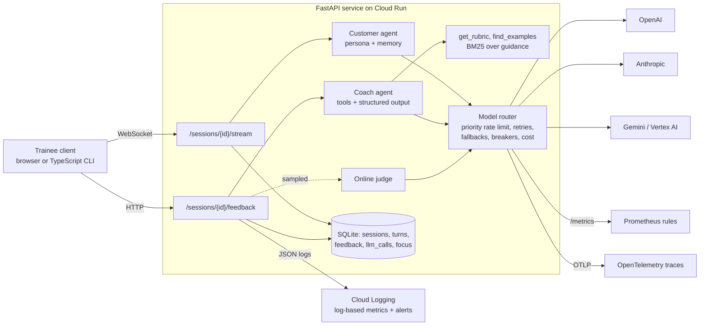

# Conversation Coach Agent

Real-time roleplay and feedback agents for sales and service training, built to be run, measured and operated rather than demoed.

A trainee talks to an AI customer over a WebSocket. The customer agent streams its replies token by token, stays in character and raises the objections of its scenario. When the call ends, a coach agent calls tools to read the rubric and coaching guidance, then returns structured feedback that is validated and checked against the transcript before anyone sees it. Around the two agents sit the parts that decide whether this works in production: a model router with fallbacks across vendors, rate limiting, circuit breakers, cost accounting per conversation, an offline eval suite for LLM judges, online scoring of live sessions, A/B analysis with a written decision rule, a load test with fault injection, and a Cloud Run deployment with CI/CD and alerting.

Everything runs offline in `mock` mode with deterministic providers, so tests, evals and load tests need no API key. `live` mode routes the same code through LiteLLM to OpenAI, Anthropic, Gemini or Vertex AI.

## Contents

- [Architecture](#architecture)
- [Results](#results)
- [Design decisions and where they break](#design-decisions-and-where-they-break)
- [Run it](#run-it)
- [Deploy to Cloud Run](#deploy-to-cloud-run)
- [Operations](#operations)
- [Limitations](#limitations)

## Architecture



| Path | What it does |
|---|---|
| `coach/llm/router.py` | Ordered model chains per task; retry with exponential backoff and jitter; fallback to the next model or vendor; per-model circuit breakers; per-vendor token buckets with realtime-first priority; cost per call and per conversation; streaming that falls back only before the first token |
| `coach/agents/customer.py` | Persona agent; streams over the router; A/B prompt variants |
| `coach/agents/coach.py` | Bounded tool-calling loop, JSON answer validated with Pydantic, every evidence quote checked against the trainee's actual words, one repair round, then a clean 503 |
| `coach/memory.py` | Token-budgeted context: recent turns verbatim, older turns folded into a running summary. Long-term memory stores each trainee's weakest dimensions for the next session |
| `coach/judge.py`, `evals/` | Keyword baseline and LLM judge; agreement metrics, position-bias and verbosity-bias probes; regression gate in CI |
| `experiments/` | A/B analysis (bootstrap CI, Welch test, sample ratio mismatch, cost guardrail, ship / hold / kill / keep running) and a check of the analysis on planted effects |
| `loadtest/` | Concurrent WebSocket roleplays with injected vendor failures; the queueing experiment |
| `deploy/`, `.github/workflows/` | Dockerfile, Cloud Build, Cloud Run service, deploy script, Cloud Monitoring alert policies, Prometheus rules, CI and a deploy workflow with a tagged-revision smoke test before traffic moves |
| `clients/ts/` | Small TypeScript client that runs a roleplay over WebSocket and prints the feedback |

## Results

All numbers below come from the reports in `reports/`, produced by the commands in [Run it](#run-it). Load and latency figures use the mock providers (about 60 ms base latency, token-by-token streaming), so they measure the service's own behaviour, not a vendor's.

### Resilience under vendor failures

200 concurrent roleplays (4 turns each, concurrency 40). 20% of calls to each primary model fail with a rate limit, timeout or 5xx, and 10% of coach answers come back malformed.

| | |
|---|---|
| User-visible errors | **0** of 800 streamed replies and 200 feedback requests |
| Failed provider calls absorbed | 261 (by retries, fallbacks and circuit breakers) |
| Replies served by a fallback model | 153 |
| Malformed feedback repaired | 17 |
| Time to first token | p50 83 ms, **p95 171 ms** |
| Feedback latency | p50 0.7 s, p95 2.8 s |
| Cost per conversation | mean $0.0044 (illustrative mock prices) |

### Experiment: realtime-first rate limiting

**Hypothesis:** under rate-limit pressure, live roleplay turns wait behind feedback and judge calls in a shared queue. **Result** (3 runs per arm, no injected failures, `python -m loadtest.compare_queueing`):

| Queueing policy | TTFT p50 | TTFT p95 | Feedback p95 |
|---|---|---|---|
| One FIFO queue per vendor | 82 ms | 388 ms | 762 ms |
| Live turns first, FIFO within a priority | 76 ms | **131 ms** | 1683 ms |

Prioritising live turns cut the p95 time to first token by about 66%. Feedback gets slower, which is the right trade for a product where a trainee is waiting mid-conversation and feedback arrives after the call. The first idea, splitting each vendor's rate limit into fixed realtime and batch pools, made things worse (p95 TTFT 595 to 731 ms with 60% and 50% reserved for live turns), because fixed pools cannot lend idle capacity to each other. I dropped it.

### Judge eval: where a keyword judge breaks

90 labelled transcripts. Each one is built from chosen trainee behaviours, so the correct score is known, and each behaviour is written as **explicit** (textbook wording), **implicit** (same behaviour, natural wording) or **decoy** (keyword-heavy wording that does not show the behaviour).

| Phrasing | Exact agreement | Bias (points) |
|---|---|---|
| Explicit | 95.2% | +0.04 |
| Implicit | **5.9%** | -2.73 |
| Decoy | 20.7% | +1.90 |
| Overall | 66.7% (QWK 0.50) | |

The keyword baseline is position-consistent and ignores verbosity, but it is close to useless on natural wording and is fooled by "I understand, but that's just how pricing works". That is the bar an LLM judge has to clear, and the reason judges get probed for position and verbosity bias rather than trusted on overall accuracy. Run the same suite on an LLM judge with `PROVIDER_MODE=live python -m evals.run_eval --judge llm`; CI fails if a change lowers agreement against the committed baseline.

### A/B analysis checked against planted effects

Before trusting the analysis on real traffic, I checked that it gives the right answer when the answer is known (`python -m experiments.simulate_ab`):

| Planted situation | Decision |
|---|---|
| +0.25 score, +4% cost | ship |
| +0.25 score, +30% cost | hold (cost guardrail) |
| No effect, +25% cost | kill |
| Real effect, 60 sessions per arm | keep running |
| Broken 54/46 assignment | invalid (sample ratio mismatch) |

Over 400 A/A runs the rule shipped a non-existent effect 2.5% of the time, matching a two-sided 95% interval, and the CI covered a planted lift in 94.8% of 400 runs. The first version of the rule got two of the five cases wrong: it killed a promising variant after 60 sessions, and the 52.5/47.5 imbalance I first planted did not trip the SRM check at p < 0.001. The fix for the first was a fixed-horizon rule: no decision in either direction before the planned sample size. For the second I kept the strict threshold and planted a clearer 54/46 split instead, so to be explicit: a 52.5/47.5 split across 4,000 trainees is not flagged at p < 0.001.

## Design decisions and where they break

**Fallback only before the first token.** If a stream fails after text has reached the user, switching models would stitch one reply from two models. The router raises `StreamInterrupted` with the partial text instead; the API keeps what was said and marks the turn degraded. If every customer model fails before any token, the trainee gets an in-character "could you repeat that?" instead of an error.

**Feedback is never shown unchecked.** Schema validation catches malformed output; the grounding check catches quotes the trainee never said, which pass schema validation and are the more dangerous failure. After one repair round the API returns 503 with `Retry-After` rather than invalid feedback.

**Circuit breakers per model, rate limits per vendor.** A failing model is skipped without a request until its half-open probe succeeds. Rate limits belong to the API key, so they are shared by all models of a vendor.

**Starvation risk.** Strict priority means sustained overload of live turns could starve feedback. At realistic loads this showed up only as slower feedback; aging (raising a request's priority the longer it waits) is the next step if it ever matters.

**Online scoring.** A sample of finished sessions (20% by default) is scored by an independent judge in the background. The gap between coach and judge scores is a metric with an alert, which catches drift after a prompt or model change that offline evals miss.

**A/B assignment by hash.** `sha256(experiment:trainee)` gives sticky, stateless assignment, so a trainee sees the same variant on every device, and two experiments are independent of each other.

## Run it

```bash
python -m venv .venv && source .venv/bin/activate
pip install -e ".[dev]"

pytest -q                                   # 47 tests, offline
uvicorn --factory coach.app:create_app      # service on :8000 in mock mode

python -m evals.run_eval                    # judge eval  -> reports/eval_*.md
python -m experiments.simulate_ab           # A/B check   -> reports/ab_simulation.md
python -m loadtest.run_load                 # load test   -> reports/load_test.md
python -m loadtest.compare_queueing         # queueing experiment

cd clients/ts && npm ci && npm run build && node dist/client.js http://127.0.0.1:8000
```

Live models: copy `.env.example` to `.env`, set `PROVIDER_MODE=live`, the model chains and the API keys, and `pip install -e ".[live]"`.

### API

| Method | Path | |
|---|---|---|
| `POST` | `/sessions` | `{trainee_id, scenario_id}` → session id, A/B variant, opening line |
| `WS` | `/sessions/{id}/stream` | send `{type: "message", text}`; receive `start`, `delta`..., `end` (model, fallback, degraded, ttft_ms) |
| `POST` | `/sessions/{id}/feedback` | validated feedback, previous focus areas, cost |
| `GET` | `/sessions/{id}` | transcript, feedback, cost by task |
| `GET` | `/experiments/report` | live A/B readout and decision |
| `GET` | `/metrics`, `/healthz`, `/readyz` | Prometheus metrics and probes |

## Deploy to Cloud Run

First deploy (creates the Artifact Registry repository, the runtime service account, secret access, log-based metrics and alert policies):

```bash
printf '%s' "$OPENAI_API_KEY"    | gcloud secrets create openai-api-key --data-file=-
printf '%s' "$ANTHROPIC_API_KEY" | gcloud secrets create anthropic-api-key --data-file=-

export PROJECT_ID=my-project REGION=europe-west3 ALERT_EMAIL=me@example.com
export CUSTOMER_MODELS=openai/<fast-model>,anthropic/<fast-model>
export COACH_MODELS=anthropic/<strong-model>,openai/<strong-model>
export JUDGE_MODELS=openai/<strong-model>
./deploy/deploy.sh
```

After that, `.github/workflows/deploy.yml` deploys on demand (or on every green push to `main` with `DEPLOY_ON_PUSH=true`): it authenticates with Workload Identity Federation (no service account keys), builds with Cloud Build, deploys a revision with no traffic under a `sha-<commit>` tag, smoke-tests that revision with an identity token, and only then moves traffic.

Cloud Run settings worth knowing: session affinity keeps a WebSocket roleplay on one instance, the request timeout is 3600 s for long-lived connections, one instance stays warm to avoid a cold start on the first call of the day, and CPU is always allocated so background online scoring finishes after the response.

Load test the deployment with `python -m loadtest.run_load --url https://<service>.run.app`.

## Operations

| Alert | Where | First thing to check |
|---|---|---|
| 5xx ratio above 2% | Cloud Monitoring | `llm call failed` logs: which model, which error. A whole chain failing means a vendor outage or an expired key |
| LLM failures above 1/s | Cloud Monitoring (log-based) | Fallbacks are absorbing it; check cost and the breaker state |
| Feedback failures | Cloud Monitoring (log-based) | Coach chain down, or repairs failing after a prompt change |
| TTFT p95 above 1 s, fallback rate above 25%, breaker open, degraded replies, cost per conversation, coach/judge disagreement | `deploy/prometheus/alerts.yml` | See each rule's description |

Logs are JSON with `severity`, `message`, `session_id`, `model` and `error`, so Cloud Logging filters like `jsonPayload.session_id="..."` show one conversation end to end. With the `otel` extra and `OTEL_EXPORTER_OTLP_ENDPOINT` set, every LLM call and tool call is also a trace span.

## Limitations

- The eval transcripts are synthetic with planted ground truth. They are good at finding *how* a judge fails; they do not replace a set of real calls labelled by experienced coaches, which should be added before trusting any judge.
- Mock providers measure the service, not vendor latency. Live numbers need a run against the deployment.
- SQLite is per instance on Cloud Run. It is enough for a demo and the experiments; production should move the store to Cloud SQL (the schema is plain SQL).
- The A/B readout on load-test traffic compares mock outputs, so its effect sizes are meaningless; it exercises the pipeline end to end.

## License

MIT
